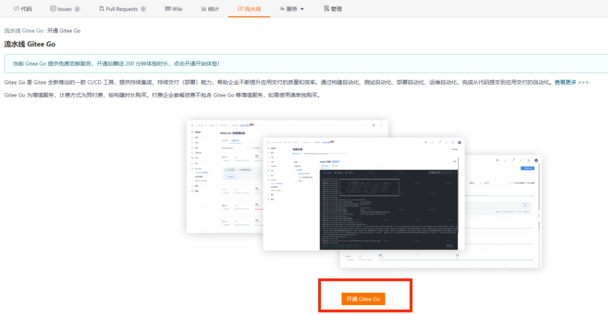
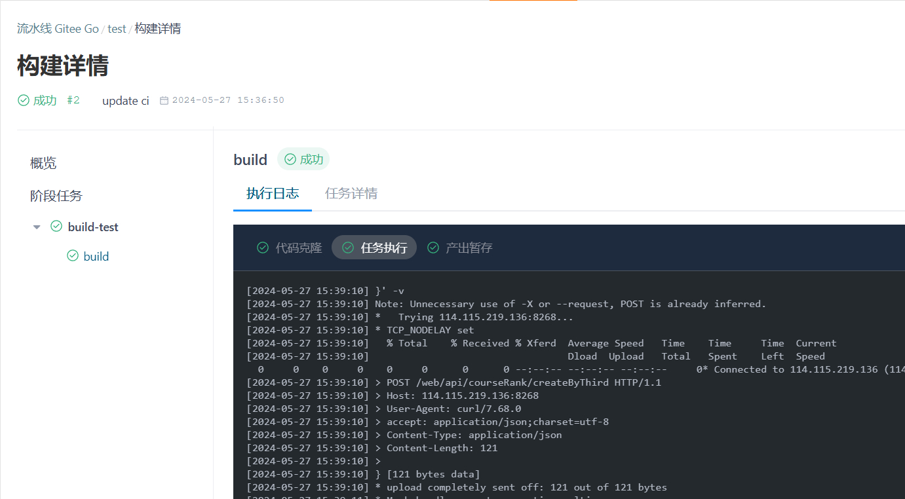

# 2024 傲来操作系统（EulixOS）训练营在线作业（专业阶段）

## 概览

### 题目列表

| 编号 | 位置              | 简介                                                | 考察点                         | 难度 |
|------|-------------------|-----------------------------------------------------|--------------------------------|------|
| 22   | `src/exercise-22` | 矩阵相乘                                            | 矩阵                           | 基础 |
| 23   | `src/exercise-23` | 2D 卷积操作                                         | 矩阵                           | 基础 |
| 24   | `src/exercise-24` | 矩阵的原地转置                                      | 矩阵                           | 基础 |
| 25   | `src/exercise-25` | 包含 0 的行列进行矩阵置零                           | 矩阵                           | 基础 |
| 26   | `src/exercise-26` | 查找矩阵中第 K 个最小的元素                         | 矩阵                           | 基础 |
| 36   | `src/exercise-36` | 编写一个内核模块求最大值                            | 内核模块                       | 基础 |
| 37   | `src/exercise-37` | 编写一个内核模块启动一个定时器                      | 内核模块                       | 基础 |
| 38   | `src/exercise-38` | 编写一个内核模块创建一个虚拟字符设备                | 内核模块                       | 中等 |
| 39   | `src/exercise-39` | 编写一个内核模块实现一个简单的文件操作函数          | 内核模块                       | 中等 |
| 43   | `src/exercise-43` | 使用内联  RISCV 汇编实现计算斐波那契数列的第 n 个数 | RISC-V 基础指令RISC-V 基础指令 | 中等 |
| 44   | `src/exercise-44` | 使用内联  RISCV 汇编实现整数数组求和                | RISC-V 基础指令                | 中等 |
| 45   | `src/exercise-45` | 使用内联  RISCV 汇编实现查找整数数组最大值          | RISC-V 基础指令                | 中等 |
| 46   | `src/exercise-46` | 使用内联  RISCV 汇编实现判断给定数组是否有序        | RISC-V 基础指令                | 中等 |
| 47   | `src/exercise-47` | 使用内联  RISCV 汇编实现给定数组目标元素个数        | RISC-V 基础指令                | 中等 |
| 50   | `src/exercise-50` | 模拟 FIFO 页面置换算法                              | 操作系统                       | 中等 |
| 51   | `src/exercise-51` | 模拟 LRU 页面置换算法                               | 操作系统                       | 中等 |
| 52   | `src/exercise-52` | 获取容器主机名                                      | 操作系统                       | 基础 |
| 53   | `src/exercise-53` | 简单虚拟地址到物理地址的转换                        | 操作系统                       | 中等 |
| 54   | `src/exercise-54` | 模拟时间片轮转调度算法                              | 操作系统                       | 中等 |
| 55   | `src/exercise-55` | 模拟虚拟内存限制                                    | 操作系统                       | 中等     |

## 使用教程

### step0

**请确保已在训练营网站个人信息中正确填写了 Gitee Username**

### step1

fork 本仓库并开通 Gitee go 服务。

首先 fork 本仓库到自己的 Gitee 下。

而后切换到 fork 后仓库的流水线页面：



点击”开通 Gitee GO“来使用 CI。


是否创建默认流水线建议选择“不创建”。

*注：开通 Gitee go 后流水线页面显示无流水线为正常现象*

### step2

将远程仓库 clone 到本地或者使用 webIDE 进行实验

项目结构

```shell
.
├── build
├── CMakeLists.txt
├── COPYING
├── img
├── Makefile
├── README.en.md
├── README.md
├── src//习题在此
└── test
```

本地需要配置部分环境，Ubuntu/Debain 配置参考如下

```shell
sudo apt install git opensbi u-boot-qemu sshpass openssh-client jq curl qemu-system-misc
```

验证 qemu 是否配置成功

```shell
qemu-system-riscv64 --version
```

而后拉取交叉编译工具链镜像

```shell
git clone https://isrc.iscas.ac.cn/gitlab/learningeulixos/2024-exercises-virtual-machines.git
```

通过 qemu 启动工具链与测试环境

```shell
qemu-system-riscv64 \
    -machine 'virt' \
    -cpu 'rv64' \
    -m 1G \
    -device virtio-blk-device,drive=hd \
    -drive file=qcow2镜像路径,if=none,id=hd \
    -virtfs local,id=lee,path=实验工程路径,mount_tag=lee,security_model=passthrough \
    -bios /usr/lib/riscv64-linux-gnu/opensbi/generic/fw_jump.elf \
    -kernel /usr/lib/u-boot/qemu-riscv64_smode/uboot.elf \
    -object rng-random,filename=/dev/urandom,id=rng \
    -device virtio-rng-device,rng=rng \
    -nographic \
    -append "root=LABEL=rootfs console=ttyS0"

```

qemu 启动后进行测试

实验被挂载到 /lee 目录下，需要切换目录进行测试

```shell
cd /lee
```

使用 GNU Make 进行构建。

``` shell
# 构建所有（exercise-xx）。
make all
# 构建一个或多个 exercise，比如，exercise-01, exercise-02。
make exercise-xx # 
```

清除产物：

```shell
make clean
```

测试

```shell
# 运行所有测试
make test
# 运行一个或多个测试，比如，test-exercise-01, test-exercise-02。
make test-exercise-xx
```

测试完成后可退出按 ctrl+A 然后按 X 退出 qemu

### step3

完成实验后，请上传至远程仓库运行 CI。详细执行情况与输出可在流水线页面查看。



最终的结果可在训练营网站查看：

https://opencamp.cn/EulixOS/camp/202401/stage/1?tab=rank

关于 Gitee go 的介绍：

[Gitee Go 2.0 - Gitee.com](https://gitee.com/help/categories/69)


## 构建

使用 GNU Make 进行构建。

``` shell
# 构建所有（exercise-xx）。
make all
# 构建一个或多个 exercise，比如，exercise-01, exercise-02。
make exercise-xx # 
```

清除产物：

``` shell
make clean
```

## 测试

``` shell
# 运行所有测试
make test
# 运行一个或多个测试，比如，test-exercise-01, test-exercise-02。
make test-exercise-xx
```

## 协议

除非另有说明，所有作品均为免费且无担保的作品，在 _Unlicense_ 的条款下已释放到公共领域。您应当已收到了一份 Unlicense 协议的副本，详情请查看 _COPYING_ 文件，如果没有收到，请参阅 <https://unlicense.org> 。
